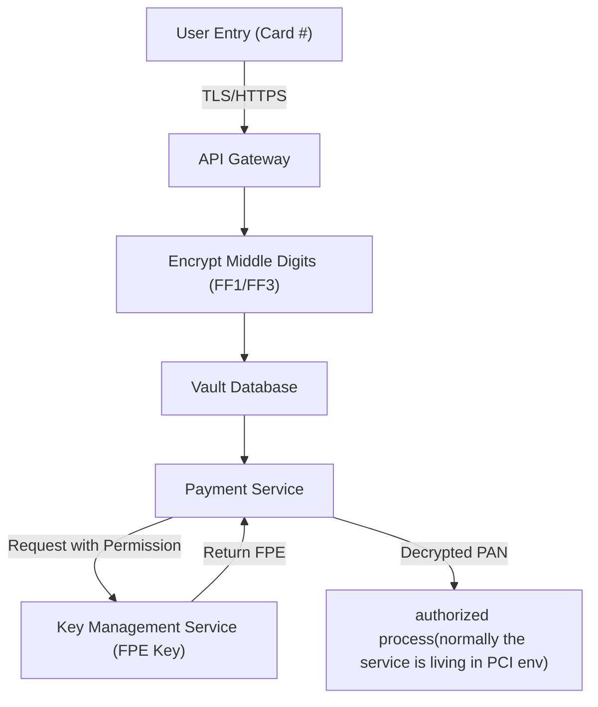

<!--
.. title: Credit card in FPE
.. slug: credit-card-in-fpe
.. date: 2025-08-09 
.. tags: Algorithm, credit card, Security
.. category: 
.. link: 
.. description: 
.. type: text
-->

## 1. **What is FPE (Format-Preserving Encryption)?**

**Format-Preserving Encryption** is a type of encryption where the **output (ciphertext)** has the same format as the **input (plaintext)**. For credit card numbers, this means the encrypted value still "looks like" a credit card number (same length, numeric only, and may still pass Luhn checks if required).

**Why important?**  
It enables legacy payment systems, databases, APIs, and message formats to store or process "encrypted" data **without breaking compatibility** or requiring massive changes across every integration point.

## 2. **How is FPE Used with Credit Card Numbers (PANs)?**

- **Credit Card PANs** (Primary Account Numbers) are 16 digits (sometimes 15 or 19, but 16 is the most common).

- Industry standards (PCI DSS) **disallow storing PAN in cleartext**

**Standard FPE Pattern:**

- **First 6 digits**: The **Issuer Identification Number** (IIN/BIN) — identifies bank and card type. Often preserved for routing/fraud/risk logic.

- **Last 4 digits**: Used for display, user verification, receipts, etc. Usually preserved.

- **Middle 6 digits**: These are **FPE-encrypted** (sometimes more digits if the card is longer).

**Example:**

| PAN (plain) | 4 5 5 6 7 3 7 5 8 6 9 0 1 2 3 4 |
| ----------- | ------------------------------- |
| FPE Result  | 4 5 5 6 7 3 X X X X X X 1 2 3 4 |

## 3. **How is FPE implemented?**

There are **multiple FPE algorithms**. 1 common, standards-based approache

### **FF1/FF3 (NIST FPE Standards)**

- **NIST SP 800-38G** defines FF1 and FF3, which are **AES-based, format-preserving encryption** algorithms.

- Widely adopted and supported by vendors (e.g., Thales, Voltage/Micro Focus, AWS, Google Cloud KMS, etc.).

- These can encrypt a string of digits and return a string of digits, with specified radix and length.

**How it works (high-level):**

- Secret key (AES key) is managed in HSM or KMS.

- Take the substring to encrypt (the middle digits), plus any required "tweak" (sometimes, transaction metadata or index).

- Produce ciphertext digits, same length.

- Combine with preserved prefix/suffix for a valid PAN-format string.

## 4. **Example System Design (Simplified):**

## 5. **Summary & Recommendations**

### Security

- **FPE** (FF1/FF3) is the modern, compliant way to "encrypt-in-place" for credit card PANs.

- **Always use enterprise-proven libraries** — never roll your own crypto!

- **Strong access control**: Only very few, auditable services can decrypt full PANs.

- **Compliance**: PCI DSS mandates all PAN storage/encryption practices — FPE is specifically allowed.
  
  
### Engineering

- Store only what is needed (BIN first-6 and last-4); never log full PAN, even in FPE form, unless business-justified.

- All cryptographic operations (encrypt/decrypt) are logged and auditable.
